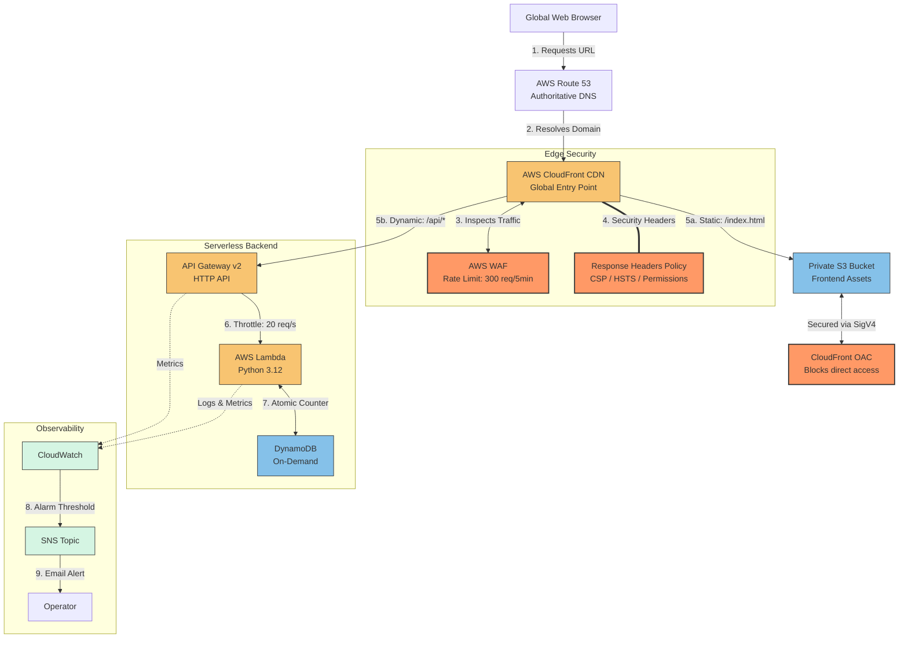

# Serverless Web Application on AWS


**Live demo:** [cliffworld.link](https://cliffworld.link)

> A full-stack serverless web application demonstrating AWS infrastructure patterns: IaC with Terraform, CI/CD with GitHub Actions, edge security with WAF, and observability with CloudWatch.

The frontend is a static site served through CloudFront. The backend is a Python Lambda function that atomically increments a visitor counter in DynamoDB. All infrastructure is defined in Terraform and deployed via GitHub Actions using OIDC — no long-lived AWS credentials.

---

## Architecture



---

## Architectural Decisions

| Choice | Alternative | Rationale |
| :--- | :--- | :--- |
| **CloudFront OAC + Private S3** | Public S3 Website Hosting | Keeps the bucket fully private. All public requests go through CloudFront/WAF with SigV4 signing — no direct bucket exposure. |
| **AWS WAF Rate-Limiting** | Code-level IP tracking | Blocks bad actors at the edge before they invoke Lambda, avoiding unnecessary compute costs. |
| **API Gateway Throttling (20 req/s, 50 burst)** | Unlimited Lambda scaling | Prevents a traffic spike from overwhelming DynamoDB or running up costs. Acts as a blast wall for the backend. |
| **On-Demand DynamoDB** | Provisioned Capacity | Scales to zero cost when idle. No baseline charges for a low-traffic application. |

---

## Security

- **CloudFront OAC** — S3 bucket is private; access only via signed CloudFront requests
- **AWS WAF** — IP-based rate limiting (300 requests per 5 minutes) plus AWS Managed Rule Set
- **Content Security Policy** — scripts restricted to `'self'`
- **HSTS** — enforces HTTPS for 1 year (`max-age=31536000`)
- **Permissions Policy** — blocks camera, microphone, geolocation at the browser level
- **Path-based routing** — static assets (`/`) served from S3 cache; API requests (`/api/*`) proxied to API Gateway with caching disabled (TTL=0)

---

## Observability

- **CloudWatch Alarms** — separate alarms for API Gateway 5XX errors, Lambda errors, and API latency
- **Alert fatigue protection** — 2-cycle evaluation prevents cold-start false positives
- **CloudWatch Dashboard** — WAF blocks, API error rates, Lambda invocations, DynamoDB capacity on a single screen
- **Structured logging** — Lambda outputs JSON logs for CloudWatch Logs Insights queries
- **SNS notifications** — email alerts when alarm thresholds are breached

---

## Cost Estimate

All services use pay-per-request or free-tier pricing. Monthly cost at different traffic levels:

| Service | Idle ($0 traffic) | 10,000 visitors/month |
| :--- | :--- | :--- |
| Lambda | $0.00 (1M free requests) | $0.00 |
| DynamoDB | $0.00 (25 WCU/RCU free) | $0.00 |
| API Gateway | $0.00 (1M free calls) | $0.00 |
| S3 | ~$0.01 | ~$0.01 |
| CloudFront | $0.00 (1TB free) | ~$0.01 |
| Route 53 | $0.50 (hosted zone) | $0.50 |
| WAF | ~$7.00 ($5 base + $1/rule) | ~$7.00 |
| **Total** | **~$7.50/mo** | **~$7.52/mo** |

> WAF dominates the cost. Removing WAF drops the bill to under $1/month but loses edge rate-limiting. For a portfolio project, this is the main cost to be aware of.

---

## Repository Layout

```text
backend/
  lambda_function.py          # Lambda handler — visitor counter API
frontend/www/
  index.html, styles.css, script.js   # Static frontend
terraform/
  provider.tf                 # AWS provider & global tags
  variables.tf / locals.tf    # Input variables and constants
  backend.tf                  # Remote state configuration
  iam.tf                      # IAM roles and policies
  s3.tf                       # S3 bucket, OAC, file uploads
  acm.tf                      # SSL/TLS certificate
  route53.tf                  # DNS zone and records
  cloudfront.tf               # CDN, WAF, security headers
  api_gw.tf                   # API Gateway v2 (HTTP)
  lambda.tf                   # Lambda function deployment
  dynamoDB.tf                 # DynamoDB table
  cloudwatch_sns.tf           # Alarms and SNS notifications
  dashboard.tf                # CloudWatch dashboard
  logging.tf                  # Log groups and retention
  cicd.tf                     # GitHub Actions OIDC role
  outputs.tf                  # Exported URLs and IDs
tests/
  unit/test_lambda_function.py  # Unit tests (moto mocks)
.github/workflows/
  pr.yml                      # PR checks: test, lint, security, plan
  deploy.yml                  # Deploy: test, apply, cache invalidation
  destroy.yml                 # Destroy with confirmation gates
```

---

## Deployment Guide

### Prerequisites
- AWS account with a registered domain in Route 53
- Terraform >= 1.10
- Python 3.12
- An S3 bucket + DynamoDB table for [Terraform remote state](https://developer.hashicorp.com/terraform/language/backend/s3)

### Steps

1. **Clone and install dev tools**
   ```bash
   git clone https://github.com/gitcliff/aws-serverless-web-platform.git
   cd aws-serverless-web-platform
   make install-dev
   make install-hooks
   ```

2. **Configure Terraform backend** — edit `terraform/backend.tf` with your state bucket and DynamoDB lock table.

3. **Set variables** — update `terraform/variables.tf` defaults or create a `.tfvars` file with your domain, bucket name, alert email, etc.

4. **Deploy**
   ```bash
   cd terraform
   make init
   make plan      # Review the plan
   make apply     # Deploy all resources
   ```

5. **Set up CI/CD** — after `make apply`, Terraform outputs a `github_actions_role_arn`. Add it as a GitHub Actions secret (`AWS_ROLE_ARN`) to enable OIDC-based deployments.

6. **Verify** — visit your domain. The visitor counter should increment on each page load.

### Tear down
```bash
make destroy
```
Or use the `destroy.yml` workflow (requires typing "destroy" + reviewer approval).

---

## Development

```bash
make install-dev    # Create .venv, install pytest/moto/boto3
make install-hooks  # Install pre-commit hooks
make test           # Run unit tests
make fmt            # Auto-format Terraform
make lint           # Lint Terraform
make security-scan  # tfsec security scan
make checkov        # Checkov compliance scan
```

---

## CI/CD

| Workflow | Trigger | Pipeline |
| :--- | :--- | :--- |
| `pr.yml` | Pull request | Unit tests → `terraform fmt -check` → tflint → checkov → `terraform plan` (posted as PR comment) |
| `deploy.yml` | Manual dispatch | Unit tests → `terraform apply` → CloudFront cache invalidation |
| `destroy.yml` | Manual dispatch | Confirmation input + reviewer approval → `terraform destroy` |

All workflows use GitHub Actions OIDC for AWS authentication — no long-lived credentials. Action versions are pinned to full commit SHAs.
