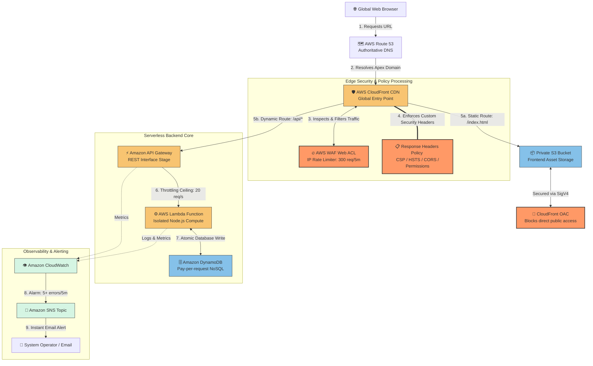

# 🌐 Enterprise Serverless Web Application & High-Scale REST API


> An enterprise-hardened, fully serverless static web application and transactional REST API natively provisioned on AWS using Terraform. 

This project demonstrates a production-ready application framework engineered with a **zero-trust defense model**, an **automated SRE observability stack**, and aggressive **FinOps guardrails** to achieve sub-second global performance and a 100% predictable, scale-to-zero cost structure.

---

## 💼 The Business Problem Solved

Traditional multi-tier web applications built on virtual instances (like EC2) or persistent container clusters (EKS/ECS) suffer from substantial operational and financial overhead:
1. **High Idle Spending:** Paying 24/7 for servers running at 5% capacity during low-traffic windows.
2. **Operational Overhead:** Wasting engineering hours on OS patching, server maintenance, scaling rules, and database capacity planning.
3. **Financial Vulnerability (The "Serverless Bill Shock"):** While basic serverless scales automatically, an unprotected app exposed to a Distributed Denial of Service (DDoS) attack or a front-end code bug can rack up thousands of dollars in unexpected execution bills overnight.

### 🎯 Project Objective
To engineer a high-performance web platform that requires **zero server management**, automatically handles massive viral traffic spikes, runs for **\$0.00 when idle**, and includes built-in edge security to isolate malicious traffic before it can inflate operational costs.

---

## 🏗️ Architectural Decisions & Trade-Off Matrix

Every component in this infrastructure was selected based on strict engineering trade-offs between **security**, **operational cost (FinOps)**, and **system reliability (SRE)**.

| Technical Choice | Alternate Option | Reason Behind the Decision |
| :--- | :--- | :--- |
| **CloudFront OAC + Private S3** | Public S3 Website Hosting | **Security:** Public S3 buckets leave content exposed to direct deletion or data scraping. Origin Access Control (OAC) keeps the bucket 100% private, forcing all public requests through the edge firewall (WAF) using cryptographic SigV4 signing. |
| **AWS WAF Rate-Limiting** | Code-level IP tracking | **FinOps / Wallet Protection:** Blocking a bad bot in application code (Lambda) means you still pay for the execution. AWS WAF blocks malicious IPs at the global edge network before they can touch your backend, saving compute costs. |
| **API Gateway Throttling** | Infinite Lambda Autoscaling | **Blast Radius Mitigation:** Infinite scaling sounds great until a massive botnet triggers 50,000 parallel requests. Enforcing a Token Bucket stage ceiling (20 req/s steady, 50 burst) forms a blast wall that protects downstream databases from falling over. |
| **On-Demand DynamoDB** | Provisioned Capacity (WCU/RCU) | **FinOps Optimization:** Provisioned databases charge by the hour regardless of usage. On-Demand pricing scales down to absolute \$0 when your site has no visitors, removing all baseline infrastructure maintenance costs. |

---

## 📌 Complete Architecture Topography



---

## 🛠️ Multi-Layer Security Architecture

### 1. Zero-Trust Frontend Insulation
Public users never access the application code directly. CloudFront isolates traffic and attaches a rigid **Response Headers Policy** that locks down browser vulnerabilities:
*   **Content Security Policy (CSP):** Limits runtime script execution exclusively to the site's own origin bundle and verified backend paths (`connect-src 'self' https://cliff.com`), stopping Cross-Site Scripting (XSS).
*   **HTTP Strict Transport Security (HSTS):** Instructs browsers to locally upgrade connection routes to HTTPS for 1 full year (`max-age=31536000`).
*   **Permissions Policy:** Enforces privacy by locking out unnecessary device hardware inputs directly at the browser layer (`camera=(), microphone=(), geolocation=()`).

### 2. Path-Based Routing Demultiplexing
CloudFront processes all entry traffic through a single custom domain. It uses path-based rules to safely segregate operations:
*   **Static Resource Requests (`/`, `/index.html`, `/styles.css`):** Directed directly to the secure S3 bucket and cached across regional global edge caches to reduce content load times.
*   **Dynamic API Requests (`/api/*`):** Proxied immediately to the API Gateway backend with edge caching completely disabled (`TTL = 0`), ensuring transactions always fetch real-time database figures.

---

## 👁️ Production-Grade SRE & Observability

A major downside of serverless is tracing failures when you don't own the underlying operating system. This project implements a **proactive monitoring and notification ecosystem** using Amazon CloudWatch:

*   **Failure Isolation:** Telemetry monitors separate infrastructure faults. If API Gateway encounters configuration or permission failures, it trips a `5XXError` alarm. If the application logic crashes, Lambda trips an `Errors` alarm.
*   **Alert Fatigue Protection:** The `api_latency` alarm tracks system degradation using two evaluation cycles. This ensures temporary network hiccups or function "cold starts" don't send false alert pages.
*   **Visual Control Room:** A custom, infrastructure-as-code **CloudWatch Dashboard** models all structural layers on a single screen, tracking everything from WAF blocked requests down to real-time Lambda execution spikes.

---

## 📂 Repository Infrastructure Layout

```text
├── provider.tf          # Core platform declarations & globally applied tagging rules
├── variables.tf         # Project variables (Domains, alert routing targets, configurations)
├── iam.tf               # Strict least-privilege identity access management policies
├── s3.tf                # Private static hosting asset containers and OAC settings
├── acm.tf               # SSL/TLS edge certificate configurations
├── route53.tf           # Authoritative public DNS hosted zone mappings
├── cloudfront.tf        # CDN routing nodes, WAF rulesets, & header policies
├── api_gateway.tf       # Backend stage micro traffic throttling ceilings
├── lambda.tf            # Ephemeral serverless compute deployment packages
├── dynamodb.tf          # On-demand persistence NoSQL database architectures
├── cloudwatch_sns.tf    # System alarm tripwires & tracking alert messaging topics
├── dashboard.tf         # Visual Operations Control Room layout definitions
└── outputs.tf           # Provisioning target endpoint receipt summaries
```

---

## 🚀 Key Technical Highlights 
*   **Infrastructure as Code (IaC):** 100% of this multi-tier ecosystem is fully declared, version-controlled, and testable using repeatable, modular HashiCorp Configuration Language (HCL).
*   **Defensive Security Engineering:** Implements strict security perimeters (WAF rate-limiting, browser security envelopes, public access blockades, explicit least-privilege IAM roles) to shield critical components.
*   **FinOps & Spend Optimization:** Leverages scale-to-zero compute runtimes and pay-per-request models to keep infrastructure expenses directly correlated with actual business traffic.
*   **SRE Observability Mindset:** Built with comprehensive metric instrumentation, automated exception alarms, and centralized operations tracking straight out of the box.
