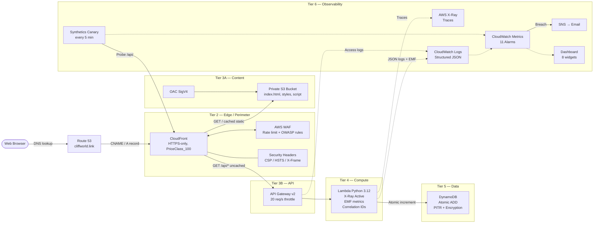

# Serverless Web Application on AWS


**Live demo:** [cliffworld.link](https://cliffworld.link)

> A production-grade serverless web application on AWS, demonstrating six architectural tiers: edge security, CDN, API routing, serverless compute, managed data, and full-stack observability. Every resource is defined in Terraform and deployed via GitHub Actions OIDC — no long-lived AWS credentials anywhere in the pipeline.

---

## Table of Contents

- [Architecture Overview](#architecture-overview)
- [Request Flow — Step by Step](#request-flow--step-by-step)
- [Security Architecture](#security-architecture)
- [Observability Architecture](#observability-architecture)
- [Architectural Decisions](#architectural-decisions)
- [Cost Estimate](#cost-estimate)
- [Repository Layout](#repository-layout)
- [Getting Started](#getting-started)
- [Development](#development)
- [CI/CD Pipeline](#cicd-pipeline)

---

## Architecture Overview

The application is structured as six discrete tiers. Each tier has a single responsibility, a defined failure boundary, and its own observability coverage.

```
┌──────────────────────────────────────────────────────────────────────────┐
│  TIER 1 — DNS                                                            │
│  Route 53  →  cliffworld.link                                            │
└────────────────────────────────┬─────────────────────────────────────────┘
                                 │
┌────────────────────────────────▼─────────────────────────────────────────┐
│  TIER 2 — EDGE / PERIMETER                                               │
│  CloudFront (PriceClass_100)  +  AWS WAF                                 │
│  ┌─────────────────────────────────────────────────────────────────────┐ │
│  │  WAF Rules                                                          │ │
│  │  ├── IP Rate Limit: 300 req / 5 min / IP  (block)                  │ │
│  │  └── AWS Managed Common Rule Set  (OWASP top 10)                   │ │
│  │  Response Headers Policy                                            │ │
│  │  ├── HSTS  max-age=31536000, includeSubDomains, preload            │ │
│  │  ├── CSP   default-src 'self'; strict script/connect policy         │ │
│  │  ├── X-Frame-Options: DENY                                          │ │
│  │  ├── X-Content-Type-Options: nosniff                                │ │
│  │  ├── X-XSS-Protection: 1; mode=block                               │ │
│  │  └── Permissions-Policy  (camera, mic, geo all disabled)           │ │
│  └─────────────────────────────────────────────────────────────────────┘ │
└──────────────┬────────────────────────────────────┬──────────────────────┘
               │ /  (static)                        │ /api/* (dynamic)
┌──────────────▼─────────────┐      ┌───────────────▼──────────────────────┐
│  TIER 3A — CONTENT         │      │  TIER 3B — API                       │
│  S3  (private bucket)      │      │  API Gateway v2  (HTTP API)          │
│  ├── No public access      │      │  ├── Throttle: 20 req/s steady       │
│  ├── OAC + SigV4 signing   │      │  ├── Burst:    50 concurrent         │
│  └── TTL: 3600s (cached)   │      │  ├── Access logs → CloudWatch Logs   │
└────────────────────────────┘      │  └── TTL: 0 (no caching)             │
                                    └───────────────┬──────────────────────┘
                                                    │
                                    ┌───────────────▼──────────────────────┐
                                    │  TIER 4 — COMPUTE                    │
                                    │  Lambda  (Python 3.12)               │
                                    │  ├── 256 MB / 5 s timeout            │
                                    │  ├── 20 reserved concurrency         │
                                    │  ├── X-Ray Active tracing            │
                                    │  ├── aws-xray-sdk  (DDB subsegments) │
                                    │  ├── Structured JSON logs            │
                                    │  ├── EMF custom metrics              │
                                    │  └── Correlation ID propagation      │
                                    └───────────────┬──────────────────────┘
                                                    │
                                    ┌───────────────▼──────────────────────┐
                                    │  TIER 5 — DATA                       │
                                    │  DynamoDB  (on-demand)               │
                                    │  ├── Atomic ADD (no race conditions)  │
                                    │  ├── Encryption at rest (AES-256)    │
                                    │  └── Point-in-time recovery (PITR)   │
                                    └──────────────────────────────────────┘
```

```
┌──────────────────────────────────────────────────────────────────────────┐
│  TIER 6 — OBSERVABILITY  (crosses all tiers)                             │
│                                                                          │
│  Distributed Traces  ──────  AWS X-Ray                                   │
│  ├── Lambda root segment (auto, Active mode)                             │
│  └── DynamoDB subsegments (patch_all() via aws-xray-sdk)                │
│                                                                          │
│  Structured Logs  ─────────  CloudWatch Logs                             │
│  ├── Lambda: JSON  {action, visitor_count, request_id, trace_id, env}   │
│  ├── API Gateway: JSON access logs (requestId, ip, status, latency…)    │
│  ├── CloudFront: access logs → S3 (prefix: cloudfront/)                  │
│  └── S3: server access logs → S3 (prefix: s3/)                          │
│                                                                          │
│  Custom Metrics  ──────────  VisitorCounter/Application namespace        │
│  └── VisitorCount (EMF — emitted from Lambda, no extra SDK)             │
│                                                                          │
│  Alarms (11 total)  ───────  CloudWatch → SNS → Email                   │
│  Perimeter  │ WAF blocked requests > 100 / 5 min                        │
│  CDN        │ CloudFront 5xx rate > 1 %                                 │
│             │ CloudFront 4xx rate > 5 %                                 │
│             │ CloudFront origin latency > 800 ms                        │
│  API        │ API Gateway 5xx errors > 5 / 5 min                       │
│             │ API Gateway avg latency > 1 000 ms                        │
│  Compute    │ Lambda errors > 5 / 5 min                                 │
│             │ Lambda p95 duration > 3 000 ms                            │
│  Data       │ DynamoDB system errors ≥ 1                                │
│             │ DynamoDB UpdateItem avg latency > 50 ms                   │
│  Synthetic  │ Canary SuccessPercent < 100 (every 5 min health check)    │
│                                                                          │
│  SLOs (composite)  ────────  CloudWatch Composite Alarms                │
│  ├── Availability SLO: API errors AND Lambda errors firing together      │
│  └── Latency SLO:  p95 > 500 ms AND avg > 1 000 ms firing together     │
│                                                                          │
│  Synthetic Monitoring  ─────  CloudWatch Synthetics Canary               │
│  └── NodeJS canary → GET /api/ → assert 200 + visitor_count number     │
│                                                                          │
│  Dashboard  ───────────────  "Serverless-App-Operations"  (8 widgets)   │
│  WAF blocks │ API errors │ Latency envelope │ Lambda perf               │
│  Lambda p95 │ DynamoDB   │ CloudFront CDN   │ Business metrics          │
└──────────────────────────────────────────────────────────────────────────┘
```

### Full Request Flow (Mermaid)



---

## Request Flow — Step by Step

| Step | What Happens | Why |
| ---: | :--- | :--- |
| 1 | Browser resolves `cliffworld.link` via **Route 53** | AWS-managed authoritative DNS with health-check capability |
| 2 | Request hits **CloudFront** edge POP (nearest of 600+) | Reduces latency via geographic distribution; enforces HTTPS |
| 3 | **WAF** evaluates each request against two rule groups | Rate-limits abusive IPs before they reach the origin; blocks OWASP top 10 patterns |
| 4 | CloudFront attaches **security response headers** | Browser-enforced CSP, HSTS, clickjacking protection — applied at the CDN layer so no application code is needed |
| 5a | `GET /` → CloudFront serves from **S3 cache** (TTL 3 600s) | Static assets don't change per-request; cache eliminates Lambda invocations entirely |
| 5b | `GET /api/*` → forwarded to **API Gateway** (TTL 0, no cache) | Counter must reflect the real state; cache would return stale counts |
| 6 | **API Gateway** enforces per-route throttle (20 req/s, burst 50) | Caps Lambda concurrency spend; acts as a blast shield between the public internet and backend |
| 7 | **Lambda** receives the request, calls `table.update_item()` | `ADD visitor_count :1` is atomic — no read-modify-write race condition even under concurrent invocations |
| 8 | **DynamoDB** atomically increments the counter and returns `UPDATED_NEW` | On-demand billing scales to zero; no provisioned capacity wasted |
| 9 | Lambda logs a **structured JSON** record and emits an **EMF metric** | JSON enables Logs Insights queries; EMF publishes `VisitorCount` to the custom `VisitorCounter/Application` namespace with no extra SDK |
| 10 | **X-Ray** records the Lambda segment and DynamoDB subsegment | End-to-end trace timeline: cold start → DynamoDB RTT → response serialisation |
| 11 | Response returns `{"visitor_count": N}` through API Gateway → CloudFront → browser | CORS header `Access-Control-Allow-Origin` is locked to `https://cliffworld.link` |

---

## Security Architecture

Security is applied in layers. Each layer independently blocks threats before they reach the next tier.

### Layer 1 — Network Edge (WAF)

| Control | Configuration | Threat Blocked |
| :--- | :--- | :--- |
| IP Rate Limiting | 300 requests per IP per 5 min → `Block` | DDoS, credential stuffing, aggressive scrapers |
| AWS Managed Rule Set | `AWSManagedRulesCommonRuleSet` | SQLi, XSS, path traversal, scanner fingerprints |
| Sampled requests | Enabled | Audit trail of blocked requests |

> **Decision:** WAF is attached to CloudFront (`scope = CLOUDFRONT`), not to API Gateway, so every request — static or dynamic — passes through the rule set before reaching any origin.

### Layer 2 — Transport (TLS + HSTS)

| Control | Value | Effect |
| :--- | :--- | :--- |
| TLS minimum version | TLSv1.2\_2021 | Blocks deprecated cipher suites |
| Viewer protocol policy | `redirect-to-https` | Forces HTTP → HTTPS at CloudFront; unencrypted requests never reach the origin |
| HSTS header | `max-age=31536000; includeSubDomains; preload` | Browser refuses future plain-HTTP connections for one year |

### Layer 3 — Browser Sandbox (Response Headers Policy)

| Header | Value | Purpose |
| :--- | :--- | :--- |
| `Content-Security-Policy` | `default-src 'self'; script-src 'self'; connect-src 'self' https://*.cliffworld.link` | Blocks inline scripts and external script injection |
| `X-Frame-Options` | `DENY` | Prevents clickjacking via iframes |
| `X-Content-Type-Options` | `nosniff` | Stops MIME-type sniffing attacks |
| `X-XSS-Protection` | `1; mode=block` | Legacy XSS filter for older browsers |
| `Permissions-Policy` | camera/mic/geo/payment all `()` | Disables hardware access APIs the app doesn't need |

### Layer 4 — Storage Access (S3 + OAC)

| Control | How | Why |
| :--- | :--- | :--- |
| Private bucket | `block_public_acls = true`, no public bucket policy | S3 URL is unreachable directly — the only valid path is through CloudFront |
| Origin Access Control | SigV4 request signing | CloudFront signs every S3 request; S3 rejects unsigned requests even if the bucket name is known |
| Server-side encryption | `AES-256` | Objects encrypted at rest in S3 |

### Layer 5 — API Rate Limiting (API Gateway)

| Control | Value | Effect |
| :--- | :--- | :--- |
| Steady-state throttle | 20 req/s | Caps throughput to Lambda; protects DynamoDB from write bursts |
| Burst limit | 50 concurrent | Absorbs momentary traffic spikes before throttling kicks in |
| Reserved Lambda concurrency | 20 | Hard ceiling on Lambda scaling — prevents account-wide concurrency exhaustion |

### Layer 6 — Identity & Secrets (OIDC / IAM)

| Control | Implementation | Why |
| :--- | :--- | :--- |
| No long-lived AWS keys | GitHub Actions OIDC — temporary STS credentials per job | Zero credential leak surface; keys expire with the workflow run |
| Least-privilege Lambda role | IAM role grants only `dynamodb:UpdateItem`, `xray:Put*`, `logs:Put*` | Blast radius of a Lambda compromise is limited to one table operation |
| Least-privilege CI/CD role | OIDC role scoped to specific repo + branch conditions | A compromised token can only deploy, not read secrets or modify IAM |

---

## Observability Architecture

The stack implements the four pillars of observability: **metrics**, **logs**, **traces**, and **synthetic monitoring**.

### Pillar 1 — Distributed Traces (AWS X-Ray)

```
Browser → CloudFront → API Gateway ──► Lambda [root segment]
                                           └── DynamoDB UpdateItem [subsegment]
                                                └── latency, status, table name
```

- Lambda `tracing_config { mode = "Active" }` — the Lambda service creates a root segment for every invocation automatically
- `aws-xray-sdk` `patch_all()` — wraps the boto3 DynamoDB client so every `update_item` call appears as a named subsegment in the trace
- `xray_recorder.configure(context_missing="LOG_ERROR")` — SDK degrades gracefully in local/test environments with no active Lambda context; tests pass without a running X-Ray daemon
- Traces are visible in the **AWS X-Ray console** — service map, latency histograms, individual traces

### Pillar 2 — Structured Logs (CloudWatch Logs)

Every log line is a single JSON object. All fields are queryable in **CloudWatch Logs Insights**.

**Lambda success log:**
```json
{
  "action": "increment_visitor_count",
  "visitor_count": 1042,
  "request_id": "abc-123",
  "trace_id": "Root=1-...",
  "environment": "prod"
}
```

**Lambda error log:**
```json
{
  "action": "increment_visitor_count",
  "error": "ProvisionedThroughputExceededException",
  "message": "...",
  "request_id": "abc-123",
  "trace_id": "Root=1-...",
  "environment": "prod"
}
```

The `trace_id` field is extracted from the `x-amzn-trace-id` request header and logged alongside every entry. This allows a **single query** to correlate Lambda logs, API Gateway access logs, and X-Ray traces for one request:

```sql
-- CloudWatch Logs Insights: full request timeline by trace ID
fields @timestamp, action, visitor_count, request_id, trace_id
| filter trace_id = "Root=1-abc123..."
| sort @timestamp asc
```

| Log source | Destination | Retention | Format |
| :--- | :--- | :--- | :--- |
| Lambda function | `/aws/lambda/<name>` (CloudWatch Logs) | 14 days | Structured JSON |
| API Gateway access | `/aws/apigateway/<name>` (CloudWatch Logs) | 14 days | JSON (requestId, ip, status, latency, integrationError) |
| CloudFront access | S3 bucket `cloudfront/` prefix | 90 days (lifecycle) | W3C Extended Log Format |
| S3 access | S3 bucket `s3/` prefix | 90 days (lifecycle) | AWS S3 Server Access Format |

### Pillar 3 — Metrics & Alarms

The application publishes to two metric namespaces:

**AWS-managed metrics** — emitted automatically by each service:

| Tier | Alarm | Threshold | Rationale |
| :--- | :--- | :--- | :--- |
| Perimeter | WAF `BlockedRequests` | > 100 / 5 min | DDoS or scraping surge |
| CDN | CloudFront `5xxErrorRate` | > 1% / 5 min | Origin-side failures reaching the browser |
| CDN | CloudFront `4xxErrorRate` | > 5% / 5 min | Broken routes or auth failures at scale |
| CDN | CloudFront `OriginLatency` | > 800 ms avg / 2 min | API + Lambda slowness visible from the edge |
| API | API Gateway `5XXError` | > 5 / 5 min | Backend errors escaping the compute tier |
| API | API Gateway `Latency` (avg) | > 1 000 ms / 2 min | User-facing response time degradation |
| Compute | Lambda `Errors` | > 5 / 5 min | Uncaught exceptions in application code |
| Compute | Lambda `Duration` (p95) | > 3 000 ms / 3 min | Tail latency approaching the 5 s timeout ceiling |
| Data | DynamoDB `SystemErrors` | ≥ 1 / 5 min | DynamoDB service-side failures |
| Data | DynamoDB `SuccessfulRequestLatency` | > 50 ms avg / 2 min | DynamoDB RTT degradation |
| Synthetic | Canary `SuccessPercent` | < 100 / 5 min | Proactive health check failure |

**Custom application metrics** — emitted by Lambda via **Embedded Metric Format (EMF)**:

EMF is a structured JSON format that the CloudWatch Logs agent automatically parses into CloudWatch metrics — no extra SDK or `PutMetricData` API call required.

```json
{
  "_aws": {
    "Timestamp": 1700000000000,
    "CloudWatchMetrics": [{
      "Namespace": "VisitorCounter/Application",
      "Dimensions": [["Environment"]],
      "Metrics": [{ "Name": "VisitorCount", "Unit": "Count" }]
    }]
  },
  "Environment": "prod",
  "VisitorCount": 1042
}
```

This populates the `VisitorCounter/Application` namespace with a `VisitorCount` metric broken down by environment, visible in the **Business Metrics** dashboard widget.

### Pillar 4 — Synthetic Monitoring (CloudWatch Synthetics)

A NodeJS canary runs **every 5 minutes** from the AWS infrastructure (not from a developer's machine) and:

1. Makes an `HTTPS GET` to `https://cliffworld.link/api/`
2. Asserts the response is `HTTP 200`
3. Asserts the response body contains a numeric `visitor_count`

This detects failures that alarms cannot — scenarios where all internal metrics look healthy but end-to-end requests are silently broken (e.g., a WAF rule blocking the `/api/` path, a bad CloudFront behaviour, or a broken Lambda alias pointer).

A `SuccessPercent < 100` metric fires the `canary-failure` alarm, which pages via SNS.

### SLO Composite Alarms

Two composite alarms aggregate child alarms into formal SLO breach signals:

| SLO | Target | Composite Rule |
| :--- | :--- | :--- |
| Availability | 99.9% uptime | `API_5xx_alarm AND Lambda_error_alarm` (both firing simultaneously) |
| Latency | p95 < 500 ms | `API_p95_latency_alarm AND API_avg_latency_alarm` |

Requiring **both** child alarms to fire simultaneously before signalling SLO breach reduces false positives from transient single-tier flaps. SLO alarms trigger the same SNS topic as operational alarms.

### CloudWatch Dashboard

The **Serverless-App-Operations** dashboard provides a single-pane view across all tiers:

| Widget | Metrics | Purpose |
| :--- | :--- | :--- |
| WAF Edge Firewall | `BlockedRequests`, `AllowedRequests` | Perimeter health, DDoS visibility |
| API Gateway Errors | `5XXError`, `4XXError` | Interface-layer fault rate |
| End-to-End Latency | `Latency`, `IntegrationLatency` | Where time is spent: network vs. compute |
| Lambda Performance | `Invocations`, `Errors`, `Throttles` | Compute health at a glance |
| Lambda p95 Duration | `Duration` (p95 + avg) | Tail latency vs. timeout budget |
| DynamoDB Health | `SuccessfulRequestLatency`, `SystemErrors` | Data-tier latency and fault rate |
| CloudFront CDN | `5xxErrorRate`, `4xxErrorRate`, `OriginLatency` | CDN-level errors and origin round trip |
| Business Metrics | `VisitorCount` (EMF, custom namespace) | Application-level throughput |

---

## Architectural Decisions

| Decision | Alternative Considered | Rationale |
| :--- | :--- | :--- |
| **CloudFront OAC + Private S3** | Public S3 Website Hosting | Keeps the bucket fully private. S3 URL is not accessible; every request must transit CloudFront and WAF. OAC with SigV4 is AWS's current recommended access pattern — the older Origin Access Identity (OAI) is legacy. |
| **AWS WAF at CloudFront (scope=CLOUDFRONT)** | WAF on API Gateway only | Attaches rate-limiting and OWASP rules at the edge before any origin is reached — blocks bad actors before they consume Lambda invocations or DynamoDB write units. |
| **API Gateway v2 HTTP API** | REST API (v1), ALB | HTTP API is ~70% cheaper than REST API and lower latency. The tradeoff is no built-in request validation or usage plans — acceptable for a single-purpose counter API where throttling is handled at the route level. |
| **API Gateway Throttle (20 req/s, 50 burst)** | Unlimited Lambda scaling | Hard concurrency cap prevents a traffic burst from exhausting the account-level Lambda concurrency limit (1,000 default) or running up unbounded DynamoDB costs. |
| **DynamoDB `ADD` expression** | Read → increment → write | `UpdateExpression = "ADD visitor_count :1"` is atomic at the DynamoDB level. A read-modify-write pattern would require a conditional write and retry loop to be safe under concurrent requests. |
| **On-Demand DynamoDB Billing** | Provisioned Capacity + Auto Scaling | Scales to zero when traffic is zero. No baseline WCU/RCU reservation cost for a low-traffic application. On-demand is more expensive per-unit at high sustained load, but the breakeven is ~200M requests/month — well beyond this project's scope. |
| **DynamoDB PITR** | Manual snapshots / AWS Backup | Point-in-time recovery enables restoration to any second in the last 35 days. A misconfigured `UpdateExpression` or accidental delete can be fully reversed without a planned backup window. |
| **Lambda Reserved Concurrency (20)** | Unreserved scaling | Two effects: (1) prevents Lambda from consuming the entire account concurrency pool during a traffic spike, (2) acts as an application-level rate limiter — excess requests are throttled at Lambda rather than silently accumulating. |
| **Lambda Alias (`live`) + `publish = true`** | Deploy to `$LATEST` | API Gateway targets the `live` alias, not `$LATEST`. Deploying a new version only requires updating the alias pointer — enabling atomic blue/green traffic shifts and immediate rollback without touching API Gateway configuration. |
| **aws-xray-sdk `patch_all()`** | Manual X-Ray subsegment annotations | `patch_all()` wraps botocore at import time, so every boto3 call (DynamoDB, etc.) automatically creates a named subsegment in X-Ray — zero per-call instrumentation code needed. `context_missing="LOG_ERROR"` makes the SDK safe in test environments where no Lambda context exists. |
| **EMF for custom metrics (no PutMetricData)** | `cloudwatch.put_metric_data()` API call | EMF (Embedded Metric Format) emits metrics as a structured JSON `print()` line — the CloudWatch Logs agent extracts them automatically. No extra IAM permission (`cloudwatch:PutMetricData`) needed, no extra latency for a synchronous API call. |
| **Correlation ID via `x-amzn-trace-id`** | Custom UUID header | The X-Ray trace ID (`x-amzn-trace-id`) is already injected by Lambda's runtime into the event headers. Reusing it avoids generating a second ID and links Lambda logs directly to X-Ray traces without string-matching. |
| **CloudWatch Synthetics Canary** | Uptime Robot / Pingdom / external SaaS | Native AWS service: canary results appear in the same CloudWatch dashboard alongside operational alarms, uses the same SNS topic for alerts, and doesn't require an external account or credentials. Costs ~$10/month at 5-minute intervals — the only observable cost increase from the observability additions. |
| **SLO Composite Alarms (AND logic)** | Single metric threshold | Requiring two correlated child alarms to fire simultaneously reduces false positives from transient single-tier flaps (e.g., a brief Lambda cold-start spike that doesn't represent a real availability incident). Composite alarms have no additional per-evaluation cost. |
| **GitHub Actions OIDC (no stored keys)** | IAM user access key + GitHub Secret | OIDC issues temporary STS tokens per-workflow-run. There is no long-lived credential to rotate, leak, or revoke. The IAM role trust policy is scoped to a specific GitHub org/repo/branch, so a compromised token from another repo cannot assume it. |
| **Terraform `null_resource` for Lambda packaging** | Committed `backend/package/` directory | The `null_resource` with `local-exec` runs `pip install` only when `requirements.txt` or `lambda_function.py` change (content-hash triggers). This keeps compiled packages out of git while making the build self-contained in Terraform for local development. CI workflows run `make build-lambda` explicitly before `terraform plan`/`apply`. |

---

## Cost Estimate

All services use pay-per-request or free-tier pricing.

| Service | Idle | 10,000 visitors/month | Notes |
| :--- | :--- | :--- | :--- |
| Lambda | $0.00 | $0.00 | 1M free requests/month covers this comfortably |
| DynamoDB | $0.00 | $0.00 | 25 WCU/RCU free tier; on-demand scales to zero |
| API Gateway | $0.00 | $0.00 | 1M free HTTP API calls/month |
| S3 | ~$0.01 | ~$0.01 | Storage + access logging bucket |
| CloudFront | $0.00 | ~$0.01 | 1 TB free data transfer/month |
| Route 53 | $0.50 | $0.50 | $0.50/month per hosted zone |
| WAF | ~$7.00 | ~$7.00 | $5/WebACL + $1/rule group; dominates cost |
| CloudWatch Synthetics | ~$10.25 | ~$10.25 | 8,640 runs/month × $0.0012; first 100 free |
| CloudWatch alarms | ~$0.30 | ~$0.30 | 11 alarms × $0.10/alarm (first 10 free) |
| **Total** | **~$18/mo** | **~$18/mo** | Flat cost — not traffic-dependent at this scale |

> **WAF and Synthetics dominate the cost.** Removing WAF saves ~$7/month but loses edge-level OWASP protection. Increasing the Synthetics interval to 15 minutes reduces canary cost to ~$3.50/month. For a portfolio project, these are deliberate trade-offs for production realism.

---

## Repository Layout

```text
backend/
  lambda_function.py          # Lambda handler — visitor counter, X-Ray, EMF metrics
  requirements.txt            # Runtime deps (aws-xray-sdk; boto3 is pre-installed)
  package/                    # Build artefact — pip install output; gitignored
  canary/
    nodejs/node_modules/
      index.js                # CloudWatch Synthetics canary script (NodeJS)
frontend/www/
  index.html                  # Single-page app shell
  styles.css                  # Dark-mode styles, status indicator
  script.js                   # API client, dark-mode toggle, 5 s polling
terraform/
  provider.tf                 # AWS + archive + null providers; global default tags
  variables.tf                # Input variables (region, env, domain, email…)
  locals.tf                   # Hardcoded constants (domain name, route keys)
  backend.tf                  # S3 + DynamoDB remote state configuration
  iam.tf                      # Lambda execution role + least-privilege policy
  cicd.tf                     # GitHub Actions OIDC role (branch-scoped trust)
  s3.tf                       # Static site bucket, OAC, file uploads
  acm.tf                      # ACM TLS certificate + DNS validation
  route53.tf                  # Hosted zone, A/AAAA alias records
  cloudfront.tf               # Distribution, WAF attachment, security headers policy
  api_gw.tf                   # API Gateway v2 HTTP API, stage, integration, route
  lambda.tf                   # Lambda function, null_resource pip build, alias
  dynamoDB.tf                 # DynamoDB table (on-demand, PITR, encryption)
  cloudwatch_sns.tf           # SNS topic + 11 CloudWatch alarms across 5 tiers
  dashboard.tf                # 8-widget CloudWatch operational dashboard
  logging.tf                  # Log groups (Lambda, API GW) + S3 access log bucket
  synthetics.tf               # Synthetics canary, artifact S3 bucket, IAM role
  slos.tf                     # SLO composite alarms (availability + latency)
  outputs.tf                  # Exported URLs, distribution ID, role ARN
  backup.tf                   # DynamoDB scheduled backup via AWS Backup
tests/
  unit/
    test_lambda_function.py   # 8 unit tests using moto DynamoDB mock
  integration/
    test_api_contract.py      # 7 integration tests validating API response contract
.github/workflows/
  pr.yml                      # PR gate: tests → fmt → tflint → checkov → tf plan
  deploy.yml                  # Deploy: tests → build-lambda → tf apply → CF invalidation
  destroy.yml                 # Teardown with confirmation input + reviewer approval
Makefile                      # Developer shortcuts (init, plan, apply, test, build-lambda…)
pyproject.toml                # pytest configuration (testpaths, pythonpath)
requirements-dev.txt          # Dev deps (pytest, moto, boto3, aws-xray-sdk)
.pre-commit-config.yaml       # Hooks: tf fmt, tf validate, tflint, tfsec, YAML checks
```

---

## Getting Started

### Prerequisites

- AWS account with a registered domain in Route 53
- Terraform >= 1.10
- Python 3.12 + pip
- An S3 bucket and DynamoDB table for [Terraform remote state](https://developer.hashicorp.com/terraform/language/backend/s3)

### Local Deployment

1. **Clone and install dev tools**
   ```bash
   git clone https://github.com/gitcliff/aws-serverless-web-platform.git
   cd aws-serverless-web-platform
   make install-dev     # Creates .venv, installs pytest/moto/boto3/aws-xray-sdk
   make install-hooks   # Installs pre-commit hooks
   ```

2. **Configure Terraform backend** — edit `terraform/backend.tf` with your S3 bucket and DynamoDB lock table names.

3. **Set variables** — update defaults in `terraform/variables.tf` (domain name, alert email, bucket name) or create a `terraform/environments/dev.tfvars` file.

4. **Build the Lambda package** — packages `aws-xray-sdk` alongside `lambda_function.py`:
   ```bash
   make build-lambda
   ```

5. **Deploy**
   ```bash
   make init    # terraform init
   make plan    # Review the change set
   make apply   # Provision all 22+ AWS resources
   ```

6. **Set up CI/CD** — after `make apply`, Terraform outputs a `github_actions_role_arn`. Add it as a GitHub Actions secret (`AWS_ROLE_ARN`) to enable OIDC-based deployments from this repo.

7. **Verify** — visit your domain. The visitor counter increments on each page load. Check the CloudWatch dashboard for live metrics.

### Tear Down
```bash
make destroy
```
Or use the `destroy.yml` GitHub Actions workflow, which requires typing `destroy` as a confirmation input and a manual reviewer approval step before `terraform destroy` runs.

---

## Development

```bash
make install-dev     # Create .venv, install all dev dependencies
make install-hooks   # Install pre-commit hooks (runs on every git commit)
make build-lambda    # pip install runtime deps into backend/package/
make test            # Run all 15 pytest tests (unit + integration)
make fmt             # Auto-format all Terraform files
make fmt-check       # Check formatting without modifying (CI gate)
make lint            # tflint — Terraform linting
make security-scan   # tfsec — Terraform security scanning
make checkov         # Checkov — IaC compliance scanning
make plan            # terraform plan (requires make init first)
make apply           # terraform apply
make destroy         # terraform destroy
```

### Running Tests

Tests use `moto` to mock DynamoDB locally — no AWS credentials required:

```bash
make test
# or for a single file:
.venv/bin/pytest tests/unit/test_lambda_function.py -v
```

The `aws-xray-sdk` is included in `requirements-dev.txt`. When tests run outside a Lambda context, `xray_recorder.configure(context_missing="LOG_ERROR")` ensures the SDK logs a warning rather than raising a `SegmentNotFoundException` — all 15 tests pass without a running X-Ray daemon.

---

## CI/CD Pipeline

| Workflow | Trigger | Steps |
| :--- | :--- | :--- |
| `pr.yml` | Pull request | Unit tests → `terraform fmt -check` → tflint → checkov → `build-lambda` → `terraform plan` (output posted as PR comment) |
| `deploy.yml` | Manual dispatch (target env) | Unit tests → `build-lambda` → `terraform apply` → CloudFront cache invalidation |
| `destroy.yml` | Manual dispatch + `"destroy"` input | Confirmation input → reviewer approval → `terraform destroy` |

### Authentication — OIDC, No Stored Keys

All three workflows authenticate to AWS using **GitHub Actions OIDC**:

1. GitHub generates a short-lived OIDC JWT for the workflow run
2. AWS STS exchanges the JWT for temporary credentials (valid for the job duration)
3. Credentials are never stored — they expire automatically when the job ends

The IAM trust policy is scoped to a specific GitHub organisation, repository, and branch:

```hcl
Condition = {
  StringEquals = {
    "token.actions.githubusercontent.com:sub" = "repo:gitcliff/aws-serverless-web-platform:ref:refs/heads/main"
  }
}
```

A token from any other repository, branch, or organisation cannot assume this role — even if it somehow obtained the role ARN.

### Pre-commit Hooks

`make install-hooks` installs the following checks that run before every `git commit`:

| Hook | What It Checks |
| :--- | :--- |
| `terraform_fmt` | All `.tf` files are formatted |
| `terraform_validate` | Configuration is syntactically valid |
| `tflint` | Terraform-specific lint rules |
| `tfsec` | Security misconfigurations in IaC |
| `trailing-whitespace` | No trailing spaces |
| `check-yaml` | Valid YAML syntax |
| `check-merge-conflict` | No unresolved merge conflict markers |
